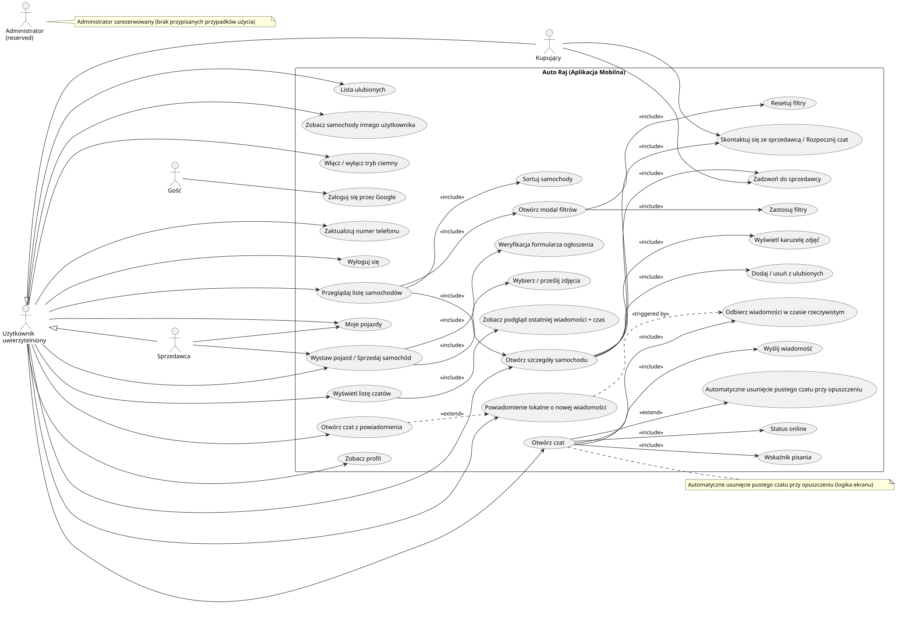

# Auto Raj (Aplikacja Mobilna)

Diagram przedstawia głównych aktorów i przypadki użycia aplikacji mobilnej do kupna i sprzedaży samochodów.

## Przypadki uzycia

## Aktorzy

- **Gość** – niezalogowany użytkownik
- **Użytkownik uwierzytelniony** – zalogowany
- **Kupujący / Sprzedawca** – role kontekstowe użytkownika
- **Administrator** – zarezerwowany (brak przypisanych przypadków użycia)

## Kluczowe funkcje

- **Autoryzacja:** logowanie przez Google, wylogowanie
- **Przeglądanie samochodów:** lista, sortowanie, filtry, szczegóły samochodu
- **Ulubione:** dodaj / usuń samochody z listy ulubionych, przeglądanie listy ulubionych
- **Czat:** start czatu, wysyłanie / odbieranie wiadomości, status online, powiadomienia
- **Sprzedaż samochodu:** wystawianie ogłoszeń, zarządzanie swoimi pojazdami
- **Profil / Ustawienia:** podgląd profilu, numer telefonu, tryb ciemny
